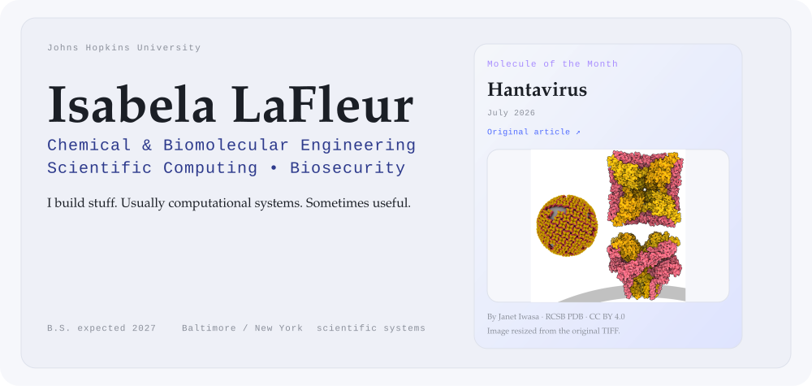
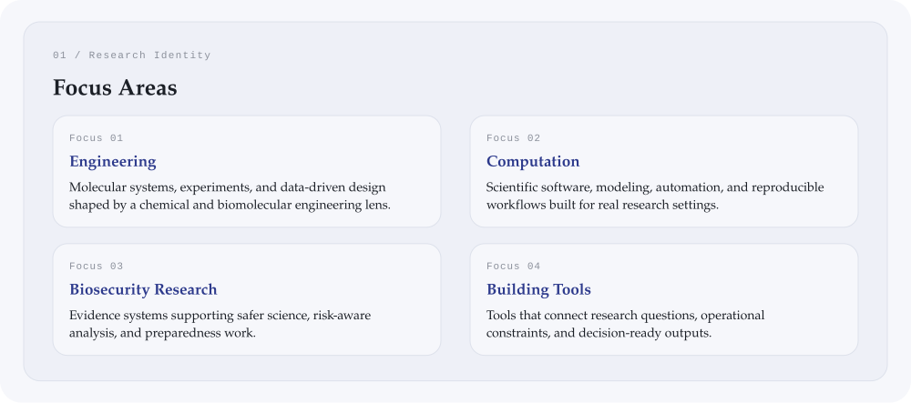
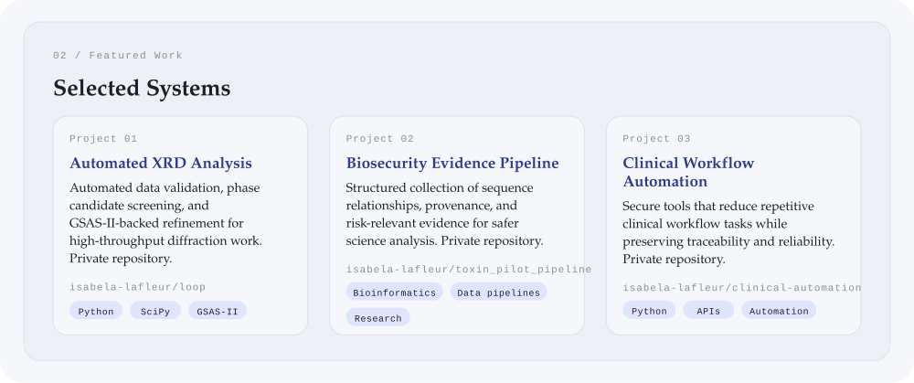
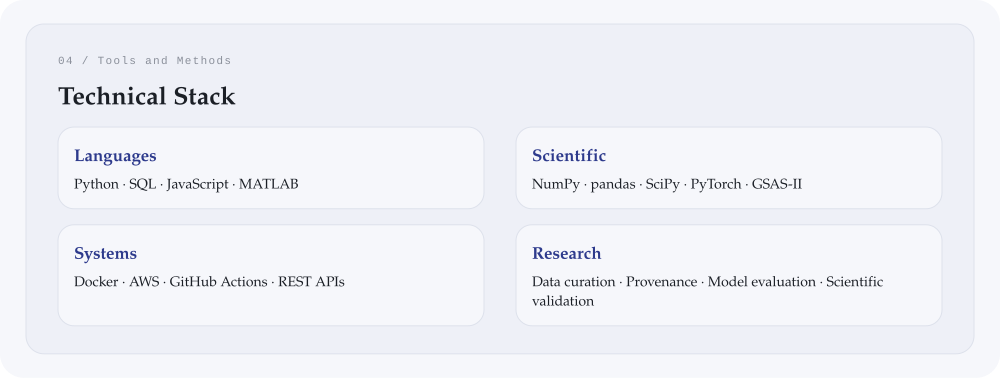
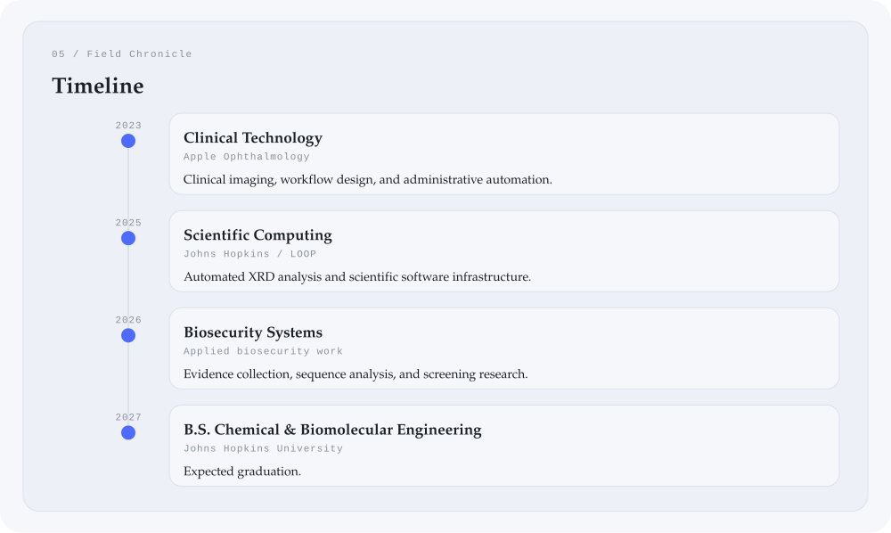
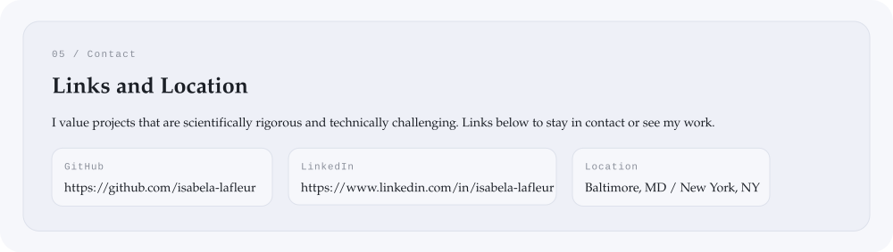

<!-- Generated file. Edit data/profile.yml or design/tokens.yml and rebuild with python3 scripts/build_profile.py -->
<picture>
  <source media="(max-width: 600px) and (prefers-color-scheme: dark)" srcset="./assets/generated/hero-mobile-dark.svg">
  <source media="(max-width: 600px) and (prefers-color-scheme: light)" srcset="./assets/generated/hero-mobile-light.svg">
  <source media="(prefers-color-scheme: dark)" srcset="./assets/generated/hero-dark.svg">
  <source media="(prefers-color-scheme: light)" srcset="./assets/generated/hero-light.svg">
  
</picture>

Molecule of the Month · July 2026 · <a href="https://pdb101.rcsb.org/motm/319">Hantavirus</a>

> **Baltimore, MD / New York, NY** 
> I work at the intersection of engineering, computation, and safer scientific systems, with a bias toward tools that make dense evidence clearer, more reproducible, and more actionable.

<picture>
  <source media="(max-width: 600px) and (prefers-color-scheme: dark)" srcset="./assets/generated/identity-mobile-dark.svg">
  <source media="(max-width: 600px) and (prefers-color-scheme: light)" srcset="./assets/generated/identity-mobile-light.svg">
  <source media="(prefers-color-scheme: dark)" srcset="./assets/generated/identity-dark.svg">
  <source media="(prefers-color-scheme: light)" srcset="./assets/generated/identity-light.svg">
  
</picture>

<picture>
  <source media="(max-width: 600px) and (prefers-color-scheme: dark)" srcset="./assets/generated/featured-work-mobile-dark.svg">
  <source media="(max-width: 600px) and (prefers-color-scheme: light)" srcset="./assets/generated/featured-work-mobile-light.svg">
  <source media="(prefers-color-scheme: dark)" srcset="./assets/generated/featured-work-dark.svg">
  <source media="(prefers-color-scheme: light)" srcset="./assets/generated/featured-work-light.svg">
  
</picture>

  <a href="https://github.com/isabela-lafleur/loop">Automated XRD Analysis</a> ·  <a href="https://github.com/isabela-lafleur/toxin_pilot_pipeline">Biosecurity Evidence Pipeline</a> ·  <a href="https://github.com/isabela-lafleur/clinical-automation">Clinical Workflow Automation</a>

<picture>
  <source media="(max-width: 600px) and (prefers-color-scheme: dark)" srcset="./assets/generated/skills-mobile-dark.svg">
  <source media="(max-width: 600px) and (prefers-color-scheme: light)" srcset="./assets/generated/skills-mobile-light.svg">
  <source media="(prefers-color-scheme: dark)" srcset="./assets/generated/skills-dark.svg">
  <source media="(prefers-color-scheme: light)" srcset="./assets/generated/skills-light.svg">
  
</picture>

<picture>
  <source media="(max-width: 600px) and (prefers-color-scheme: dark)" srcset="./assets/generated/timeline-mobile-dark.svg">
  <source media="(max-width: 600px) and (prefers-color-scheme: light)" srcset="./assets/generated/timeline-mobile-light.svg">
  <source media="(prefers-color-scheme: dark)" srcset="./assets/generated/timeline-dark.svg">
  <source media="(prefers-color-scheme: light)" srcset="./assets/generated/timeline-light.svg">
  
</picture>

<picture>
  <source media="(max-width: 600px) and (prefers-color-scheme: dark)" srcset="./assets/generated/contact-mobile-dark.svg">
  <source media="(max-width: 600px) and (prefers-color-scheme: light)" srcset="./assets/generated/contact-mobile-light.svg">
  <source media="(prefers-color-scheme: dark)" srcset="./assets/generated/contact-dark.svg">
  <source media="(prefers-color-scheme: light)" srcset="./assets/generated/contact-light.svg">
  
</picture>

  <a href="https://github.com/isabela-lafleur">GitHub</a> ·  <a href="https://www.linkedin.com/in/isabela-lafleur">LinkedIn</a>

Open placeholders: profile.linkedin · profile.resume_url. Update them in `data/profile.yml`.
